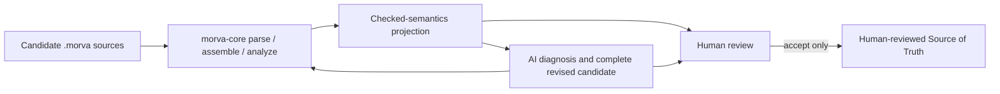
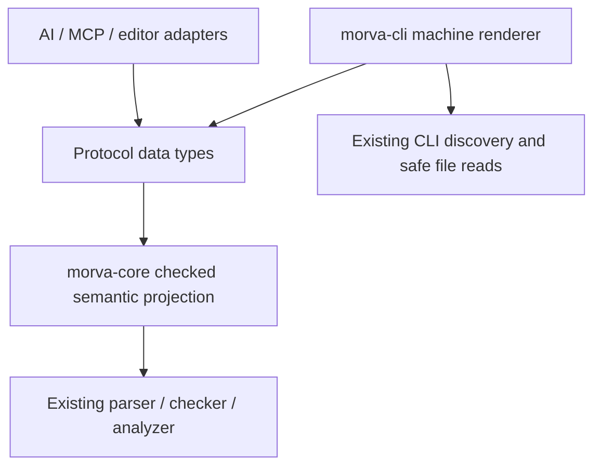

# Architecture Spine — Morva Checked Semantics Protocol

## Design Paradigm

**Deterministic projection pipeline with human-gated candidates.** `morva-core` parses, checks, and owns facts; a pure projection emits a versioned read-only document; AI proposes new source candidates; a fresh check and explicit human decision are the only path toward acceptance.



Dependency direction:



## Invariants & Rules

### AD-1 — Core-owned projection [ADOPTED]

- **Binds:** protocol producer, CLI, adapters
- **Prevents:** CLI and AI consumers independently reconstructing incompatible Morva semantics
- **Rule:** `morva-core` MUST own the checked semantic projection; CLI and adapters may only discover/read inputs, invoke core, and serialize the returned protocol model.

### AD-2 — Error gate excludes semantic models

- **Binds:** result envelope, every consumer
- **Prevents:** partial or invalid AST data masquerading as checked semantics
- **Rule:** any lexical, syntax, project, or semantic error sets `result.status = invalid` and `checked_model = null`; only zero-error parse, assembly, and check may emit `checked_model`.

### AD-3 — Exact local provenance [ADOPTED]

- **Binds:** sources, nodes, findings, coverage records
- **Prevents:** virtual-span leakage, stale diagnostics, and incompatible editor/AI locations
- **Rule:** inline exact UTF-8 source bytes plus half-open source-local byte ranges are authoritative for source-owned facts; source-less core project errors use an explicit subject location. Merged virtual spans and absolute host paths MUST NOT cross the protocol boundary.

### AD-4 — Revision-scoped identity

- **Binds:** subject revision, source revision, node and finding IDs
- **Prevents:** consumers treating a location-derived ID as durable across source edits
- **Rule:** every document binds to exact source revisions; `source_id`, `node_id`, and `finding_id` are document-local only and MUST NOT be used as cross-revision identity.

### AD-5 — Coverage is independent from validity [ADOPTED]

- **Binds:** warnings, compatibility containers, soft behavior, AI decisions
- **Prevents:** `exit 0` or `valid` being interpreted as complete semantic coverage
- **Rule:** coverage MUST report `assessment = complete | unavailable`; complete coverage reports `fully_modeled` and every unmodeled construct. Coverage warnings remain visible even when `status = valid`.

### AD-6 — Read-only, human-gated revisions [ADOPTED]

- **Binds:** AI loop and all adapters
- **Prevents:** AI output silently mutating the Source of Truth or a green check auto-accepting semantic drift
- **Rule:** the protocol defines no mutation operation. An AI revision is a complete new candidate source set, checked from scratch; only an external explicit human decision may accept it.

### AD-7 — Semantic projection, not Rust serialization

- **Binds:** checked model and compatibility policy
- **Prevents:** public protocol breakage from Rust enum/layout refactors or unresolved AST details
- **Rule:** v1 uses the closed L0 algebra in the companion schema for every current declaration, field/member/parameter, clause, assignment, scenario item, expression, root binding, operator, and type. Every required collection is present even when empty; protocol types MUST NOT expose Rust layout, private indices, merged spans, or unresolved checker internals.

### AD-8 — Major-version and capability negotiation

- **Binds:** protocol evolution and consumers
- **Prevents:** silent reinterpretation when fields or semantic discriminants evolve
- **Rule:** v1 has five mandatory capabilities and `language_version = 0.1`. Consumers reject unknown protocol majors, unsupported language versions, missing mandatory capabilities, and unknown semantic discriminants; they ignore only unknown object members. Any new semantic discriminant or breaking meaning/position change requires a new major.

### AD-9 — Reproducible emission [ADOPTED]

- **Binds:** serialization, snapshots, AI context caching
- **Prevents:** identical inputs producing noisy or irreproducible machine context
- **Rule:** core sorts canonical project logical names by exact UTF-8 bytes before assembly, ID assignment, hashing, and emission. Output follows that source order, existing finding order, and source declaration order; it contains no timestamps, random IDs, process IDs, or absolute paths. Identical canonical logical names, source bytes, producer/language versions, and enabled capability set SHOULD produce identical bytes.

### AD-10 — Local production boundary

- **Binds:** operational envelope, adapters, source privacy
- **Prevents:** a read-only export feature silently becoming a network service or exfiltrating inline source
- **Rule:** the first implementation is a local in-process core projection plus CLI serialization. Persistence, remote transport, AI-provider calls, authentication, MCP, and automatic upload are separate capabilities requiring explicit authorization and specifications.

### AD-11 — Interoperable revision digest [ASSUMPTION]

- **Binds:** source/subject revision fields
- **Prevents:** producer-specific unstable hashing and ambiguous multi-file framing
- **Rule:** v1 uses SHA-256 over exact file bytes and a specified length-framed project byte stream. It proves content identity/integrity only—not origin, authorship, authenticity, or approval. This design/prototype is not production-shippable until dependency/change-control approval is recorded and the actual core producer passes known-answer and conformance tests; no fallback hash may claim v1 compatibility.

### AD-12 — Complete human-review evidence bundle

- **Binds:** external AI/review workflow
- **Prevents:** a reviewer seeing only a green revised result and accepting semantic drift or omitted intent
- **Rule:** every immutable review bundle names intent identity/version, current accepted revision, candidate revision and parent, complete revised source, cumulative accepted-to-candidate diff or all intermediate events, relevant findings/coverage, and AI rationale. Candidate parent MUST equal the current accepted revision. Acceptance requires a fresh `valid` result and compare-and-swap over accepted revision plus intent identity/version. Incomplete coverage requires per-item acknowledgement keyed by `(candidate_revision, typed coverage identity + location)` with `out_of_scope` or `externally_evidenced`, otherwise the decision is `block`.

### AD-13 — Core-owned protocol invariant validation

- **Binds:** protocol producer and conformance claims
- **Prevents:** schema-valid but semantically inconsistent envelopes crossing the machine boundary
- **Rule:** JSON Schema validates shape only. Before serialization, `morva-core` MUST validate canonical logical-name and capability order, consecutive source IDs, file/project source cardinality, source-less project restrictions, recomputed exact-byte source/subject digests, location references/ranges, status/error consistency, coverage/warning correspondence, exact checked-model completeness, `node_id`/semantic-key uniqueness and key resolution, expression/type and clause/state-phase invariants, checked-node ownership, and system shell provenance. Only documents passing both layers are protocol-conforming.

### AD-14 — Project and pre-core failure boundary [ADOPTED]

- **Binds:** project errors, CLI machine emission, operational failures
- **Prevents:** invented source provenance and partial/misleading JSON on unreadable input
- **Rule:** source-less `ProjectDiagnostic::Project` is encoded with subject location and may use `sources: []`. Usage, discovery, read, identity-race, and UTF-8 decode failures occur before core and emit no checked-semantics document or partial stdout; they retain operational exit `2` on stderr.

### AD-15 — Complete multi-file system provenance [ADOPTED]

- **Binds:** checked system node and project assembly
- **Prevents:** the first source shell accidentally becoming sole owner of a merged system
- **Rule:** the checked system carries ordered `shell_locations` for every contributing same-name shell; no single `location` substitutes for this set.

### AD-16 — Canonical logical input identity

- **Binds:** source order, names, IDs, digests, reproducibility
- **Prevents:** absolute-path leakage, Unicode-normalization divergence, and caller-order-dependent project identities
- **Rule:** the CLI supplies exact UTF-8 final path components as logical subject/source names separate from host paths; no Unicode normalization occurs. Core rejects duplicate project logical names, sorts by exact UTF-8 name bytes, and assigns opaque ordinal `source:<index>` IDs.

### AD-17 — Revision-local opaque semantic identity

- **Binds:** checked-model references and downstream consumers
- **Prevents:** consumers parsing implementation-specific key text or treating a regenerated key as durable cross-revision identity
- **Rule:** every `semantic_key` is unique and referentially complete only within one checked model and revision. It is an opaque exact UTF-8 string: consumers compare it for equality but MUST NOT parse its spelling or persist it as cross-revision identity. `node_id` has the same revision-local durability boundary.

## Consistency Conventions

| Concern | Convention |
|---|---|
| Protocol name | `morva.checked-semantics` |
| Protocol major | JSON integer `1` |
| Capability IDs | Lowercase dotted strings rooted at `morva.` |
| Source IDs | Opaque `source:<index>` after canonical ordering; unique inside one document |
| Locations | Source-owned: UTF-8 local half-open byte ranges; project-owned: subject location |
| Finding order | Existing core merged finding order |
| Validity | Read `severity` and `result.status`; never infer from code range or message |
| Unknown data | Ignore unknown object members; reject unknown semantic discriminants |
| Mutation | Complete replacement candidate outside protocol; no patch/apply method |
| Serialization | UTF-8 JSON, two-space indentation, final LF, schema field order |

## Stack

| Name | Version |
|---|---|
| Rust edition | 2024 |
| Morva producer seed | 0.1.0 |
| JSON | RFC 8259 |
| JSON Schema | Draft 2020-12 |
| Protocol | `morva.checked-semantics` v1 |

## Structural Seed

```text
morva-core
  existing parser/checker/analyzer
  protocol projection types       # future approved implementation

morva-cli
  existing safe input discovery
  machine serializer              # future approved implementation

_bmad-output/planning-artifacts/architecture/architecture-Morva-2026-08-13/
  ARCHITECTURE-SPINE.md
  MORVA-CHECKED-SEMANTICS-PROTOCOL-v1.md
  schema/morva-checked-semantics-v1.schema.json
  VALIDATION-REPORT.md
  samples/

docs/prototypes/
  morva-ai-loop.prototype.html    # throwaway validation UI, never production
```

## Capability → Architecture Map

| Capability / Area | Lives in | Governed by |
|---|---|---|
| Read-only checked model | future `morva-core` projection | AD-1, AD-2, AD-7 |
| Diagnostics and warnings | existing core reports → protocol findings | AD-2, AD-3, AD-5 |
| Exact source traceability | source bundle and locations | AD-3, AD-4, AD-11 |
| Machine serialization | future CLI renderer | AD-1, AD-8, AD-9 |
| AI diagnosis/revision | external adapter | AD-5, AD-6, AD-10 |
| Human decision | external workflow | AD-6, AD-12 |
| Protocol conformance | future core invariant validator + JSON Schema | AD-2, AD-3, AD-5, AD-8, AD-13 |
| Project/source identity | future protocol core entry point + existing CLI discovery | AD-9, AD-14, AD-16 |
| Multi-file system provenance | checked-model system projection | AD-3, AD-15 |
| Logic validation | throwaway HTML and evidence samples | AD-2, AD-5, AD-6 |

## Deferred

- CLI command/flag and coexistence with stable text output; decide in an implementation specification.
- SHA-256 dependency/implementation choice; revisit only through dependency change control.
- Large-project JSONL/streaming, source redaction, external bundles, and UTF-16 editor positions; revisit with measured consumers.
- Cross-revision semantic IDs and incremental invalidation; revisit after an editor/watch workload proves need.
- AI orchestration, model/provider selection, prompt design, persistence, MCP, networking, auth, and automated write-back; all are outside this local read-only feature.
- L1/L2 language expansion; protocol consumers must represent current semantics and may not anticipate them as supported.
- Serializer failure, broken stdout, peak-memory limits, and JSONL thresholds; the implementation specification must require atomic/no-partial emission and add measured thresholds before selecting a machine CLI surface.
